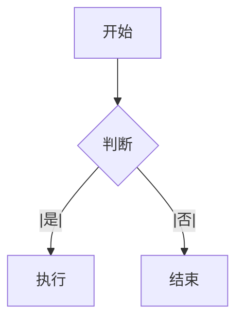
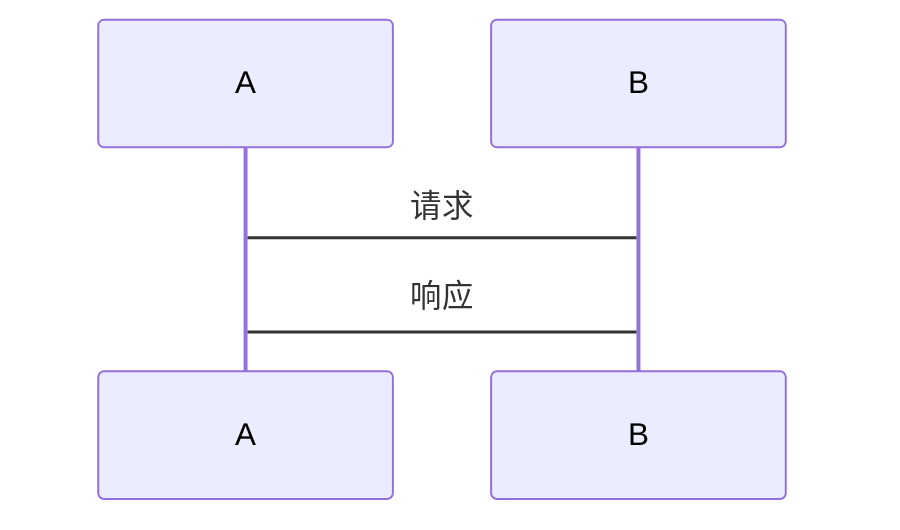

# Markdown 转 Lark 测试用例

## 基础文本

### 段落
这是普通文本段落。

### 粗体和斜体
这是 **粗体** 和 *斜体* 的文本。

### 删除线
这是 ~~删除线~~ 的文本。

### 代码
这是一段 `行内代码` 的示例。

```
这是代码块
```

## 标题

# 一级标题
## 二级标题
### 三级标题
#### 四级标题
##### 五级标题
###### 六级标题

## 列表

### 无序列表
- 项目 1
- 项目 2
- 项目 3

### 有序列表
1. 第一项
2. 第二项
3. 第三项

### 任务列表
- [ ] 未完成任务
- [x] 已完成任务

### 多级列表
- 一级项目
  - 二级项目
    - 三级项目
- 另一个一级项目

## 引用

> 这是一段引用文本。
>
> 多行引用。
> 可以有多行。

## 分隔线

---

## 代码块

```javascript
function hello() {
  console.log('Hello, World!');
}
```

```typescript
interface User {
  id: string;
  name: string;
}
```

```python
def greet(name):
    return f"Hello, {name}!"
```

## 链接

这是一个 [链接文本](https://feishu.cn)。

[Feishu](https://feishu.cn)

## 图片


## 表格

| 列 1 | 列 2 | 列 3 |
|--------|------|------|
| 数据 1 | 数据 2 | 数据 3 |

## Mermaid 图表





## 组合示例

# 文档标题

这是一个段落，包含**粗体**、*斜体*、`代码`和[链接](https://feishu.cn)。

## 功能列表

- 功能 1：基础转换
- 功能 2：支持多种 Markdown 语法
- 功能 3：生成飞书剪贴板格式

> 这是一个引用块，用于引用重要信息。

## 代码示例

```javascript
const converter = new MarkdownToLarkConverter();
const result = converter.convert(markdown);
```

## 复杂示例

### 嵌套列表

1. 主项 1
   - 子项 A
   - 子项 B
2. 主项 2
   - 子项 C

### 混合格式

这是一个段落，包含：
- **粗体列表项**
- `代码列表项`
- [x] 已完成任务
- [ ] 未完成任务

> 包含多种格式的引用块。

---

## 完整文档测试

以上示例涵盖了 Markdown 的主要语法，可用于测试转换功能。
